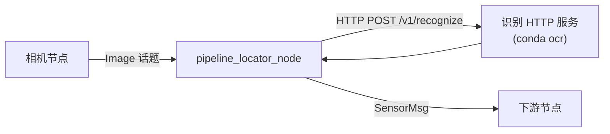

# PaddleOCR 管线仪屏幕识别

基于 [PaddleOCR](https://github.com/PaddlePaddle/PaddleOCR) 与 OpenCV 的**管线探测仪（管线仪）LCD 屏幕信息识别**方案。

本仓库为 **ROS2 colcon 工作区**，采用**识别服务与 ROS 节点分离**的架构：

| 组件 | 目录 | 运行环境 | 职责 |
|------|------|----------|------|
| 识别 HTTP 服务 | `recognition_service/` | conda 环境 `ocr` | 图像识别、标定配置、数字模板 |
| ROS2 节点 | `src/paddle_ocr/` | 系统 ROS2 Humble | 订阅图像话题 → HTTP 请求 → 发布 `SensorMsg` |
| 自定义消息 | `src/paddle_ocr_msgs/` | 系统 ROS2 | 定义 `SensorMsg` |



## 适用设备（占位）

标定数据仅对指定型号有效，部署前请填写 `recognition_service/config/DEVICE.md` 并确认 `config/` 已针对该设备标定。

| 项目 | 说明 |
|------|------|
| 设备名称 | `<DEVICE_NAME>` |
| 设备型号 | `<MODEL_NAME>` |
| 生产厂商 | `<MANUFACTURER>` |
| 屏幕规格 | `<SCREEN_WIDTH>` × `<SCREEN_HEIGHT>` |
| 固件版本 | `<FIRMWARE_VERSION>` |

## 识别字段

| 字段 | 说明 | 示例 |
|------|------|------|
| `signal_strength` | 信号强度 | `0.0%` |
| `pipeline_current` | 管线电流 | `350 mA` |
| `burial_depth` | 埋设深度 | `140 m` |
| `compass_angle` | 罗盘角度 | `61°` |
| `arrow_direction` | 箭头方向 | `none` / `left` / `right` / `both` |

识别方法：七段 LCD 模板匹配 + OpenCV 罗盘/箭头检测，实拍图自动水平翻转。

## 仓库结构

```
paddleocr/                          # colcon 工作区根目录
├── src/
│   ├── paddle_ocr_msgs/            # 自定义消息 SensorMsg
│   └── paddle_ocr/                 # ROS2 节点包（轻量，无 Paddle 依赖）
│       ├── paddle_ocr/
│       │   ├── pipeline_locator_node.py
│       │   ├── ocr_client.py       # HTTP 客户端
│       │   └── result_mapper.py    # JSON → SensorMsg
│       ├── config/pipeline_locator.yaml
│       └── launch/pipeline_locator.launch.py
├── recognition_service/            # 识别服务（conda，含 COLCON_IGNORE）
│   ├── paddle_ocr/                 # 识别核心库 + HTTP API
│   ├── config/                     # rois.json, compass.json, digit_slots.json
│   ├── assets/digit_templates/
│   ├── examples/images/
│   └── start_api_server.sh
├── environment.yml                 # conda 环境定义（识别服务用）
├── requirements.txt
├── build/ install/ log/            # colcon 产物（gitignore）
└── output/                         # 识别服务调试输出（gitignore）
```

## 快速开始

需要**两个终端**：一个跑识别服务（conda），一个跑 ROS 节点（系统 ROS）。

### 终端 1：识别 HTTP 服务

```bash
# 首次使用：创建 conda 环境
conda env create -f environment.yml
conda activate ocr

cd recognition_service
./start_api_server.sh
```

验证：

```bash
curl http://127.0.0.1:8000/health
```

### 终端 2：ROS2 节点

```bash
# 编译前请退出 conda，避免干扰 colcon
conda deactivate

source /opt/ros/humble/setup.bash
cd ~/paddleocr
colcon build
source install/setup.bash

ros2 launch paddle_ocr pipeline_locator.launch.py
```

查看输出话题：

```bash
ros2 topic echo /pipeline_locator/sensor
```

## 环境安装

### 识别服务（conda）

```bash
conda env create -f environment.yml   # 环境名: ocr
conda activate ocr
```

也可在 `recognition_service/` 下安装为可编辑包（可选）：

```bash
conda activate ocr
cd recognition_service
pip install -e .
# 之后可直接使用: paddle_ocr_api / paddle_ocr_recognize
```

### ROS2 工作区

依赖：ROS2 Humble、`cv_bridge`、`rclpy`。**不需要** conda 环境。

```bash
conda deactivate
source /opt/ros/humble/setup.bash
colcon build
source install/setup.bash
```

> **注意**：在已激活 conda 的环境下执行 `colcon build` 可能因 Python 路径冲突导致编译失败（如 `ModuleNotFoundError: No module named 'em'`）。

## 识别 HTTP 服务

详见 [`recognition_service/README.md`](recognition_service/README.md)。

### 启动

```bash
conda activate ocr
cd recognition_service
./start_api_server.sh
```

环境变量（可选）：

| 变量 | 默认 | 说明 |
|------|------|------|
| `PADDLE_OCR_API_HOST` | `127.0.0.1` | 监听地址 |
| `PADDLE_OCR_API_PORT` | `8000` | 监听端口 |

### API 端点

| 方法 | 路径 | 说明 |
|------|------|------|
| GET | `/health` | 健康检查 |
| GET | `/v1/config` | 读取标定配置 |
| PUT | `/v1/config` | 更新标定配置 |
| POST | `/v1/recognize` | 上传图片识别（`image` 文件 + 可选 `debug`、`frame_id`） |

### 命令行识别（无需 ROS）

```bash
conda activate ocr
cd recognition_service
python -m paddle_ocr.recognize_cli examples/images/image0000000.bmp
# 或（pip install -e . 后）: paddle_ocr_recognize examples/images/image0000000.bmp
```

## ROS2 节点

### 启动

```bash
ros2 launch paddle_ocr pipeline_locator.launch.py
```

指定配置文件：

```bash
ros2 launch paddle_ocr pipeline_locator.launch.py \
  config_file:=/path/to/pipeline_locator.yaml
```

### 节点参数

配置文件：`src/paddle_ocr/config/pipeline_locator.yaml`（安装后位于 `share/paddle_ocr/config/`）

| 参数 | 说明 | 默认值 |
|------|------|--------|
| `image_topic` | 订阅的图像话题 | `/camera/image_raw` |
| `image_type` | `raw`（`sensor_msgs/Image`）或 `compressed` | `raw` |
| `output_topic` | 识别结果发布话题 | `/pipeline_locator/sensor` |
| `inference_rate_hz` | 向识别服务发起请求的频率 (Hz) | `2.0` |
| `output_frame_id` | 输出 `SensorMsg.header.frame_id` | `pipeline_locator` |
| `api_base_url` | 识别 HTTP 服务地址 | `http://127.0.0.1:8000` |
| `api_timeout_sec` | HTTP 请求超时（秒） | `5.0` |
| `debug` | 识别服务是否保存调试图到 `output/` | `false` |
| `qos_reliability` | 图像订阅 QoS：`best_effort` / `reliable` | `best_effort` |
| `qos_history_depth` | 图像订阅队列深度 | `1` |

节点工作流程：

1. 订阅 `image_topic`，缓存最新一帧
2. 按 `inference_rate_hz` 定时取最新帧，编码为 JPEG
3. `POST {api_base_url}/v1/recognize` 获取 JSON
4. 转换为 `paddle_ocr_msgs/msg/SensorMsg` 发布到 `output_topic`

### 消息类型 `paddle_ocr_msgs/msg/SensorMsg`

```
std_msgs/Header header
geometry_msgs/Vector3 magnetic_field
float64[9] magnetic_field_covariance
float32 signal_strength          # 0.0~1.0（百分比/100）
float32 depth_meters
float32 current_milliamps
float32 pipeline_heading_degrees
float32 signal_strength_percent
bool left_arrow
bool right_arrow
```

字段映射（识别 JSON → `SensorMsg`）：

| SensorMsg 字段 | 来源 |
|----------------|------|
| `signal_strength_percent` | 屏幕信号强度读数（如 `0.0%` → `0.0`） |
| `signal_strength` | `signal_strength_percent / 100` |
| `current_milliamps` | 管线电流（如 `350 mA` → `350`） |
| `depth_meters` | 埋设深度（如 `140 m` → `140`） |
| `pipeline_heading_degrees` | 罗盘角度 |
| `left_arrow` / `right_arrow` | 箭头方向 |
| `magnetic_field` | 由管线方向角度转换的单位方向向量 (x, y) |

## 标定与换型

标定文件均在 `recognition_service/config/`：

| 文件 | 说明 |
|------|------|
| `rois.json` | 各字段 ROI `[x1, y1, x2, y2]` |
| `compass.json` | 罗盘圆心与半径 |
| `digit_slots.json` | 七段数码管切片比例 |
| `DEVICE.md` | 设备型号说明 |

更换设备型号时：

1. 更新 `DEVICE.md`
2. 重新标定上述 JSON 文件
3. 删除 `assets/digit_templates/` 后重新运行识别，自动生成新模板
4. 重启识别 HTTP 服务

## 常见问题

| 现象 | 原因 | 处理 |
|------|------|------|
| `colcon build` 报 `No module named 'em'` | conda 环境干扰 ROS 构建 | 先 `conda deactivate` 再编译 |
| 节点启动即退出 `RcutilsLogger.info() takes 2 positional arguments...` | ROS 日志不支持 `%s` 多参数格式 | 已修复，请重新 `colcon build` |
| 日志持续 `Recognition failed` | 识别服务未启动或地址错误 | 确认 `curl http://127.0.0.1:8000/health` 正常，检查 `api_base_url` |
| 日志 `Waiting for image` | 无图像发布到 `image_topic` | 检查相机节点及话题名 |
| 识别结果全为 NaN | 标定不匹配或图像质量差 | 检查 `recognition_service/config/` 标定 |

## 依赖版本

| 组件 | 环境 | 主要依赖 |
|------|------|----------|
| 识别服务 | conda `ocr` | Python 3.10, paddlepaddle 2.6.2, paddleocr 2.7.0, opencv 4.6, fastapi |
| ROS 节点 | 系统 ROS2 Humble | rclpy, cv_bridge, paddle_ocr_msgs |

完整 Python 依赖见 `requirements.txt` / `environment.yml`。

## License

MIT
